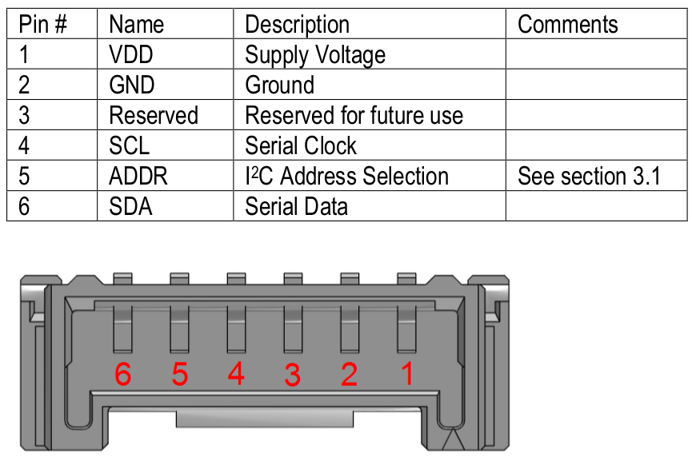

# Sensirion Raspberry Pi I²C SFX6XXX Driver

The repository provides a driver for setting up a sensor of the SFX6XXX family to run on a Raspberry Pi over I²C.


Click [here](https://sensirion.com/sfc6000) to learn more about the Sensirion SFX6XXX sensor family.


## Supported sensor types

| Sensor name   | I²C Addresses  |
| ------------- | -------------- |
|[SFC6000](https://sensirion.com/products/catalog/SFC6000/)| **0x24**, 0x23, 0x22, 0x21, 0x20, 0x42, 0x41|
|[SFC6000D-5SLM](https://sensirion.com/products/catalog/SFC6000D-5slm/)| ****|
|[SFC6000D-50SLM](https://sensirion.com/products/catalog/SFC6000D-50slm/)| ****|
|[SFC6000D-20SLM](https://sensirion.com/products/catalog/SFC6000D-20slm/)| ****|
|[SFM6000](https://sensirion.com/products/catalog/SFM6000)| **0x24**, 0x23, 0x22, 0x21, 0x20, 0x42, 0x41|
|[SFM6000D-20SLM](https://sensirion.com/products/catalog/SFM6000D-20slm)| ****|
|[SFM6000D-50SLM](https://sensirion.com/products/catalog/SFM6000D-50slm)| ****|
|[SFM6000D-5SLM](https://sensirion.com/products/catalog/SFM6000D-5slm)| ****|

The following instructions and examples use a *SFC6000*.


## Connect the sensor

Your sensor has 5 different connectors: VDD, GND, SCL, ADDR, SDA.
Use the following pins to connect your SFX6XXX:

| *SFX6XXX* | *Cable Color*  |   *Raspberry Pi*   |
| :----------------: | -------------- | ------------------ |
| VDD | red | Pin
| GND | black | Pin 6
| SCL | yellow | Pin 5
| ADDR | purple | Pin
| SDA | green | Pin 3


### Detailed sensor pinout



| *Pin* | *Cable Color* | *Name* | *Description*  | *Comments* |
|-------|---------------|:------:|----------------|------------|
| 1 | red | VDD | Supply Voltage | +24V
| 2 | black | GND | Ground |
| 3 |  | NC | Do not connect |
| 4 | yellow | SCL | I2C: Serial clock input |
| 5 | purple | ADDR |  | Leave floating for default i2c address 0x24
| 6 | green | SDA | I2C: Serial data input / output |


## Quick start example

- [Install the Raspberry Pi OS on to your Raspberry Pi](https://projects.raspberrypi.org/en/projects/raspberry-pi-setting-up)
- [Enable the I²C interface in the raspi-config](https://www.raspberrypi.org/documentation/configuration/raspi-config.md)
- Download the SFX6XXX driver from [Github](https://github.com/Sensirion/raspberry-pi-i2c-sfx6xxx) and extract the `.zip` on your Raspberry Pi
- Connect the SFX6XXX sensor as explained in the [section above](#connect-the-sensor)
- The provided example is working with a SFC6000, I²C address 0x24.
  In order to use the code with another product or I²C address you need to change it in the call sfx6xxx_init(ADDRESS) in
  `sfx6xxx_i2c_example_usage.c`. The list of supported I²C-addresses is found in the header
  `sfx6xxx_i2c.h`.

- Compile the driver
    1. Open a [terminal](https://projects.raspberrypi.org/en/projects/raspberry-pi-using/8)
    2. Navigate to the driver directory. E.g. `cd ~/raspberry-pi-i2c-sfx6xxx`
    3. Navigate to the subdirectory example-usage.
    4. Run the `make` command to compile the driver

       Output:
       ```
       rm -f sfx6xxx_i2c_example_usage
       cc -Os -Wall -fstrict-aliasing -Wstrict-aliasing=1 -Wsign-conversion -fPIC -I. -o sfx6xxx_i2c_example_usage  sfx6xxx_i2c.h sfx6xxx_i2c.c sensirion_i2c_hal.h sensirion_i2c.h sensirion_i2c.c \
           sensirion_i2c_hal.c sensirion_config.h sensirion_common.h sensirion_common.c sfx6xxx_i2c_example_usage.c
       ```
- Test your connected sensor
    - Run `./sfx6xxx_i2c_example_usage` in the same directory you used to
      compile the driver. You should see the measurement values in the console.

## Troubleshooting

### Building driver failed

If the execution of `make` in the compilation step 3 fails with something like

```bash
 make: command not found
```

your RaspberryPi likely does not have the build tools installed. Proceed as follows:

```
$ sudo apt-get update
$ sudo apt-get upgrade
$ sudo apt-get install build-essential
```


### Initialization failed

If you run `./sfx6xxx_i2c_example_usage` but do not get sensor readings but something like this instead

```
Error executing read_product_identifier(): -1
Error executing start_o2_continuous_measurement(): -1
Error executing read_flow(): -1
...
```
then go through the below troubleshooting steps.


-   Ensure that you connected the sensor correctly: All cables are fully
    plugged in and connected to the correct pin.
-   Ensure that I²C is enabled on the Raspberry Pi. For this redo the steps on
    "Enable the I²C interface in the raspi-config" in the guide above.
-   Ensure that your user account has read and write access to the I²C device.
    If it only works with user root (`sudo ./sfx6xxx_i2c_example_usage`), it's
    typically due to wrong permission settings. See the next chapter how to solve this.

### Missing I²C permissions

If your user is missing access to the I²C interface you should first verfiy
the user belongs to the `i2c` group.

```
$ groups
users input some other groups etc
```
If `i2c` is missing in the list add the user and restart the Raspberry Pi.

```
$ sudo adduser your-user i2c
Adding user `your-user' to group `i2c' ...
Adding user your-user to group i2c
Done.
$ sudo reboot
```

If that did not help you can make globally accessible hardware interfaces
with a udev rule. Only do this if everything else failed and you are
reasoably confident you are the only one having access to your Pi.

Go into the `/etc/udev/rules.d` folder and add a new file named
`local.rules`.
```
$ cd /etc/udev/rules.d/
$ sudo touch local.rules
```
Then add a single line `ACTION=="add", KERNEL=="i2c-[0-1]*", MODE="0666"`
to the file with your favorite editor.
```
$ sudo vi local.rules
```

## Contributing

**Contributions are welcome!**

We develop and test this driver using our company internal tools (version
control, continuous integration, code review etc.) and automatically
synchronize the master branch with GitHub. But this doesn't mean that we don't
respond to issues or don't accept pull requests on GitHub. In fact, you're very
welcome to open issues or create pull requests :)

This Sensirion library uses
[`clang-format`](https://releases.llvm.org/download.html) to standardize the
formatting of all our `.c` and `.h` files. Make sure your contributions are
formatted accordingly:

The `-i` flag will apply the format changes to the files listed.

```bash
clang-format -i *.c *.h
```

Note that differences from this formatting will result in a failed build until
they are fixed.


## License

See [LICENSE](LICENSE).